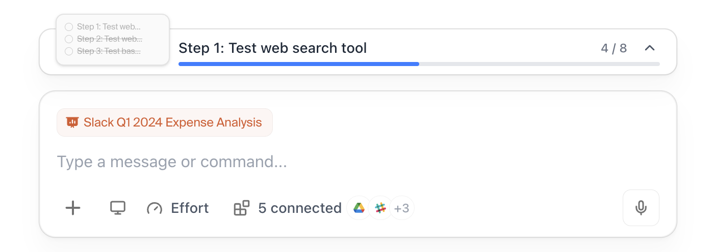

# 🧠 context-input

A simple step-based input component I built for [Context](https://www.context.inc/) meant to guide users through onboarding or any multi-step process. It's basically a prompt input, but with a progress bar and steps on top so users know what to do and what’s next.

You can try it live here:  
👉 [context-input.vercel.app](https://context-input.vercel.app/)



---

## 🚀 Tech Stack

- [Next.js](https://nextjs.org/)
- [Tailwind CSS](https://tailwindcss.com/)
- [shadcn/ui](https://ui.shadcn.com/)

---

## 🔧 Setup

Clone it and you’re good to go:

```bash
git clone https://github.com/siyabendoezdemir/context-input.git
cd context-input
bun install # or npm install / yarn
bun dev     # or npm run dev / yarn dev
```

No config, no props, just works.

---

## ⚠️ Customization

Right now, it's not customizable out of the box — you'd need to tweak the code if you want to change step styles, colors, or anything else.

---

## 💬 Why I built this

The founder of Context needed me to create a component as a quick pulse check.
Was fun to build and I might keep improving it as it gets used more.

---

## 📄 License

MIT — feel free to fork, remix, or build on top of it.

---

## ✌️ From Siya

Made with way too much caffeine in Basel 🇨🇭  
If you use it somewhere cool, [let me know on X](https://x.com/siyabuilt)!
